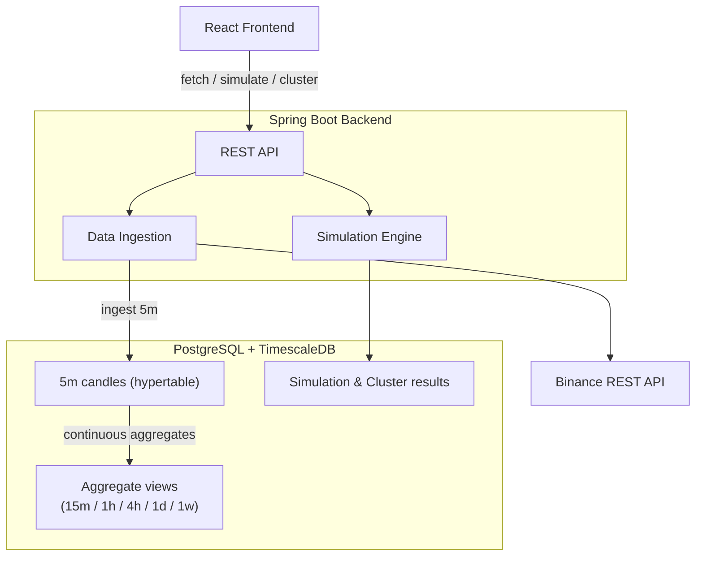
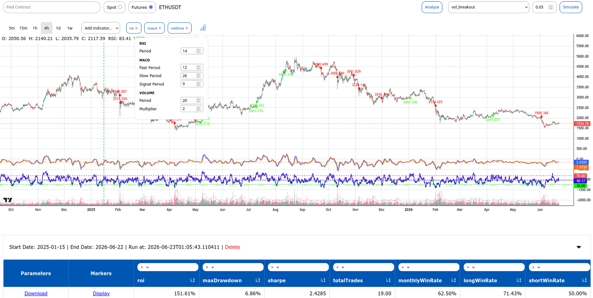
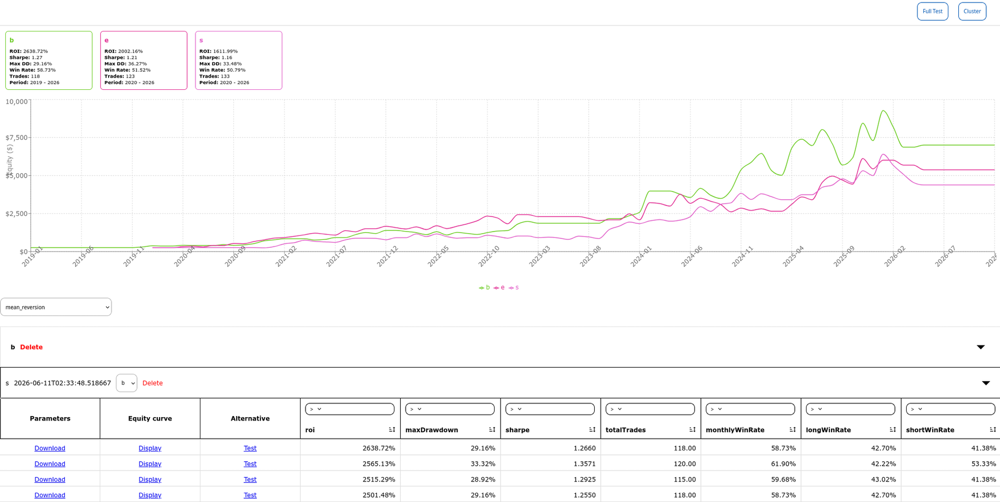

# Backtesting Engine

A strategy backtesting platform built on Spring Boot, React, PostgreSQL, and TimescaleDB. It ingests OHLCV data from Binance, generates multi-timeframe views automatically, and runs parameterised strategy simulations with results surfaced on an interactive TradingView chart. A second view handles cross-asset cluster analysis — finding TP/SL parameter combinations that hold up across a basket of instruments.

---

## 1. Overview

---

## 2. Previews

*`/` — contract search, timeframe selector, TradingView chart with indicators, simulation window picker, and results table with marker overlay.*

*`/analyze` — multi-asset cluster upload, results table with equity curves per instrument.*

---

## 3. Tech Stack

| Layer | Technology |
|---|---|
| Backend framework | Spring Boot 3.5.6 (Java 21) |
| Frontend | React (Vite) |
| Database | PostgreSQL + TimescaleDB |
| ORM | Spring Data JPA |
| Exchange connectivity | Binance Spot & Futures REST APIs |
| Numeric precision | decimal4j |
| Packaging | Maven, Docker |

---

## 4. Backend

### 4.1 Data Ingestion

When a contract is selected in the UI, the backend fetches raw candlestick data from Binance at 5-minute granularity and persists it into a TimescaleDB hypertable. From there, TimescaleDB continuous aggregate views automatically materialise the higher timeframes (15m, 1h, 4h, 1d, 1w) — no resampling happens at the application level. The backend simply queries the appropriate view depending on which timeframe is active in the UI.

### 4.2 Simulation Engine

The simulation engine is the core of the application. Given a set of candles, a strategy, a risk percentage, and a date window, it sweeps a grid of TP/SL parameter combinations and evaluates each one independently. To ensure indicators are properly warmed up before the simulation window begins, 200 candles of lookback data are always prepended before the range under test.

Results are persisted per run, grouped by strategy, contract, and timeframe, so past simulations can be reloaded without re-running.

The engine also supports a marker replay mode — given a specific set of parameters from a completed run, it re-executes just that combination and returns the entry points for chart display.

### 4.3 Cluster Engine

The cluster engine extends the simulation to multiple assets at once. It takes a map of ticker → candle data, runs the full TP/SL parameter sweep across every asset simultaneously, and filters the results down to combinations where the designated pivot asset performs optimally and no other asset in the basket has a negative result. Results are grouped by a parameter hash so that a single TP/SL combination can be traced across all tickers in the cluster for equity curve display.

The engine also supports ad-hoc single-param replays against freshly uploaded datasets without persisting — used when testing a shortlisted parameter set against new instruments.

### 4.4 Persistence

The database holds two logical groups of data:

**Simulation data** — each unique (strategy, contract, timeframe) combination is stored as a strategy record. Each time a simulation is run against a date window, a run record is created containing the start/end dates and risk percentage. Every TP/SL combination evaluated in that run is stored as an individual result with its full metric set: ROI, max drawdown, Sharpe ratio, trade count, and win rates (overall, long, short).

**Cluster data** — clusters are grouped under a named strategy. Each cluster stores the pivot ticker and the list of assets included. Each execution of a cluster is stored as a run, and every TP/SL combination for every ticker in that run is stored as an individual cluster simulation record, tagged with a parameter hash that links matching combinations across tickers.

---
