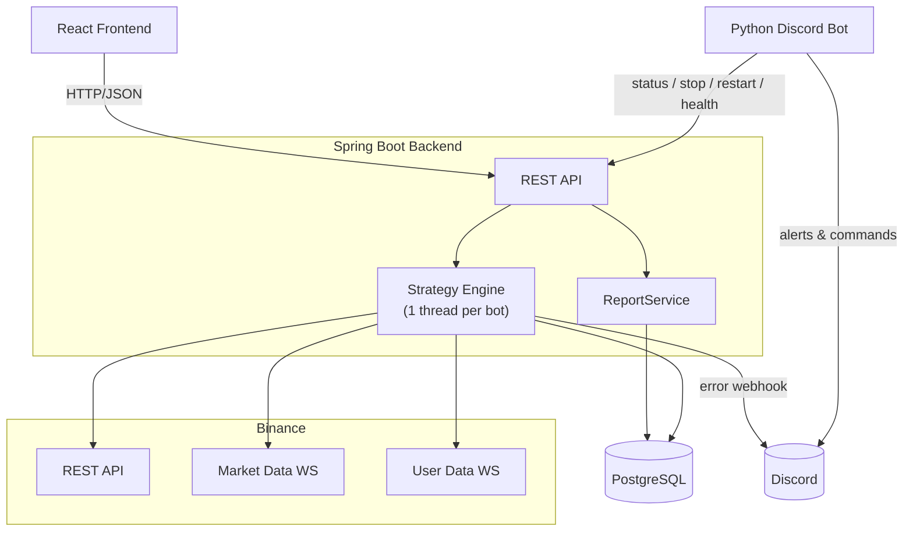
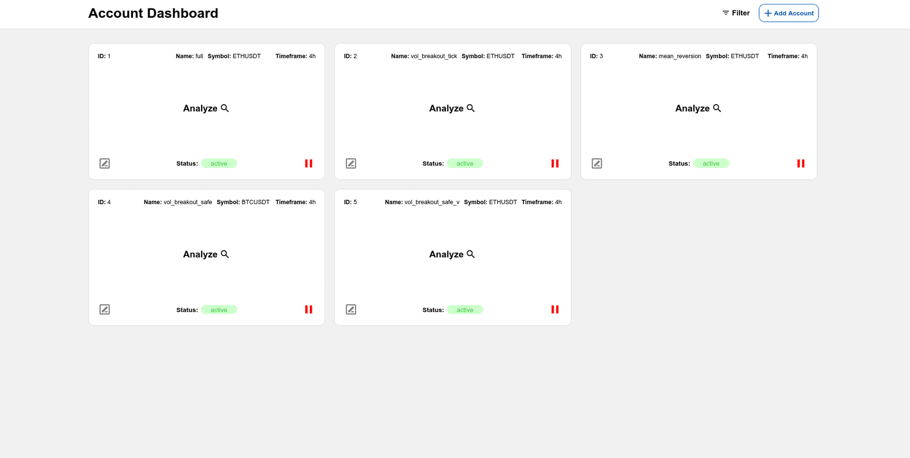
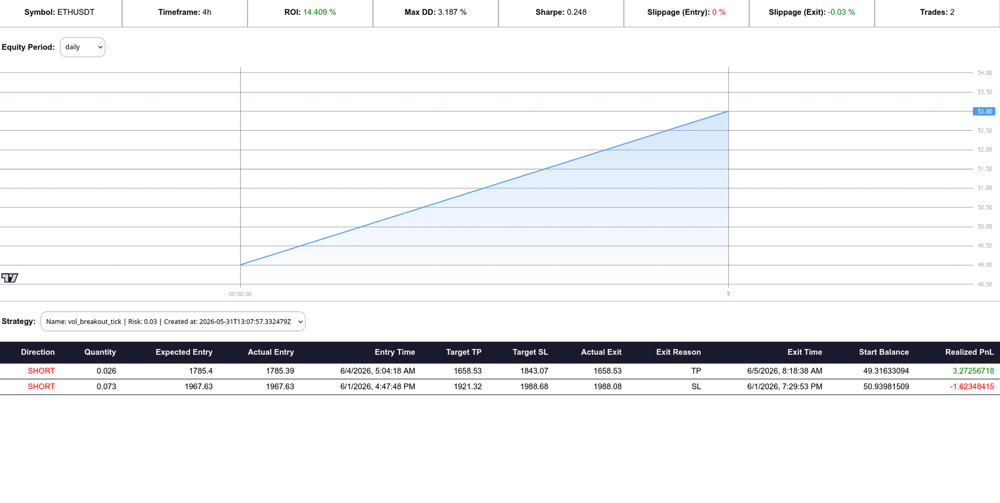
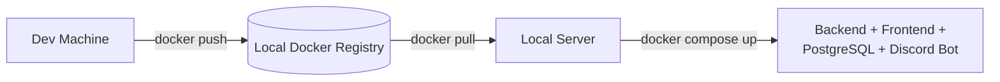

# Live Trading System

A live cryptocurrency trading platform that runs automated strategy bots against Binance USDS-M Futures, with a Spring Boot backend, a React frontend, PostgreSQL persistence, and a Python Discord bot that doubles as an alerting and remote-control surface.

---

## 1. Overview

Each row in the `bot_account` table represents one Binance API key/secret pair that can run **one strategy at a time**. The backend exposes a REST API to launch, stop, restart, and report on bots. Each running bot is an in-memory `Strategy` instance, executing on its own thread, holding two live WebSocket connections to Binance (market data + user data), and persisting its state and trade history to PostgreSQL.

A separate Python process consumes that same REST API to:
- Post error alerts to a Discord channel/webhook
- Act as a remote control panel — get the status of one bot or all bots, restart a bot, stop a bot, and run a health check that detects deadlocked/hung stream processing.

---

## 2. Previews

*Bot dashboard — configured accounts, active bots, and live status at a glance.*

*Per-bot performance report — balance, Sharpe ratio, drawdown, and trade history.*

---

## 3. Tech Stack

| Layer | Technology |
|---|---|
| Backend framework | Spring Boot 4.0.3 (Java 21), `spring-boot-starter-webmvc` |
| Frontend | React |
| Database | PostgreSQL, accessed via `spring-boot-starter-data-jpa` |
| Exchange connectivity | `binance-derivatives-trading-usds-futures` (official Binance USDS-M Futures connector) for REST; OkHttp `WebSocket` client for streams |
| Observability | OpenTelemetry API (`GlobalOpenTelemetry.getTracer("trading-bot")`) |
| Numeric precision | `decimal4j` for price/quantity rounding to exchange tick/step size |
| Alerting / control bot | Python process (Discord bot), calling back into the REST API |
| Packaging / runtime | Maven (`spring-boot-maven-plugin`), Docker, Docker Compose |

---

## 4. Backend Components

### 4.1 Bot lifecycle — `launchBot()`

`POST /runBot` triggers `launchBot(BotAccountTotalData)`, which:

1. Builds a Binance `DerivativesTradingUsdsFuturesRestApi` client, signed with the account's API key/secret.
2. Calls `accountInformationV3` to validate the credentials and `exchangeInformation` to derive the symbol's price/quantity precision (`PrecisionPair`) from its `PRICE_FILTER`/`LOT_SIZE` filters.
3. Gracefully stops any existing running bot for the same account ID (`Strategy.stop()` + cancel the `Future`) before replacing it — only one strategy per account runs at a time.
4. Upserts the `BotAccount` row in PostgreSQL.
5. Instantiates the correct `Strategy` subclass via `initStrategy()`, a `switch` over a strategy-name string (`full`, `long_only`, `short_only`, several `vol_breakout*` variants, and `mean_reversion*` variants).
6. Wires a **self-restart trigger** into the strategy: a closure that simply re-invokes `launchBot()` with the same account data — this is how `Strategy.restart()` recovers from a hung state without the controller needing bespoke restart logic per strategy.
7. Submits `strategy.start()` to the cached thread pool and registers the resulting `BotInstance` in `runningBots`.
8. Blocks on `strategy.awaitInitialized()` so the HTTP response only returns once the strategy has seeded its account state and persisted its `StrategyInstance` row — not once it's fully streaming.

### 4.2 `Strategy` — the trading engine

`Strategy` is an abstract base class; each concrete subclass only needs to implement the actual entry/exit signal logic. The base class owns everything else: exchange connectivity, state management, persistence, and self-healing.

**Construction** wires in the Binance REST client, the account's `PrecisionPair`, and configuration (WebSocket URLs, the Binance REST base URL, and the Discord webhook URL) sourced from `UrlConfig`.

**`start()`** does, in order:
1. Marks the strategy running, seeds account state from the exchange (`seedAccountState()`), and persists a new `StrategyInstance` row (`saveInstanceData()`) — releasing `initializedLatch` in a `finally` block so the controller's `awaitInitialized()` unblocks even if seeding throws.
2. Spawns a **daemon thread** running `startUserStream()` — the private/user data WebSocket that reports fills, balance changes, and position state.
3. Fetches initial candle history (`getData(null)`).
4. Starts the **market data stream** (`startCandleStream()`) on the calling (pool) thread.

### 4.3 `ReportService`

Builds a `ReportDTO` from a `StrategyInstance` ID — symbol, timeframe, strategy name, start/current balance, Sharpe ratio, max drawdown, and entry/exit slippage. Used by `/​{id}/report`, `/reportActive`, and `/getStrategyTrades` to give both the frontend and the Discord bot a consistent performance summary.

### 4.4 Persistence (PostgreSQL via Spring Data JPA)

Inferred entities, accessed through repositories on `RepoConfig`:

- **`BotAccount`** — one row per Binance API key pair: name/label, API key/secret, and a pointer (`currentStrategyInstanceId`) to the strategy currently assigned to it.
- **`StrategyInstance`** — one row per "run" of a strategy on an account: strategy name, symbol, timeframe, risk %, parameters, execution type, start/current balance, `createdAt`. Historical instances let `/getAllStrategies` show a bot account's run history.
- **`Trade`** — one row per closed trade: direction, quantity, expected vs. actual entry price, entry/exit time, TP/SL targets, actual exit price, exit reason, realized PnL, and the account balance at trade start (used for slippage and performance reporting).

---

## 5. Frontend (React)

The React app talks to the backend over plain HTTP/JSON (CORS is wide open via `@CrossOrigin(origins = "*")`). Based on the API surface, it covers:
- A dashboard listing all configured bot accounts and which are currently active (`GET /`, `GET /list`).
- A ticker/symbol browser (`GET /getTickers`).
- A form to configure and launch a bot (`POST /runBot`) and stop one (`POST /stopBot`).
- Per-bot reporting and trade history views (`GET /{id}/report`, `GET /reportActive`, `GET /getStrategyTrades`).
- A strategy history view per account (`GET /getAllStrategies`, `GET /getCurrentRunningStrategyId`).

---

## 6. Python Discord Process

A separate Python service that is **not** part of the Spring Boot deployment unit, but is a client of its REST API plus a poster to Discord. Responsibilities:

- **Error alerting** — surfaces failures (either by polling the backend or receiving the same Discord webhook the `Strategy` class posts to) into a Discord channel.
- **Report/control service**, exposed as Discord commands:
  - Status of a single bot → `GET /{id}/report`
  - Status of all bots → `GET /reportActive` / `GET /list`
  - Restart a bot → `POST /{id}/restart`
  - Stop a bot → `POST /{id}/stop`
  - Health check / deadlock detection → `GET /healthCheck`

This gives operational control over the trading bots from Discord without needing to open the web frontend.

---

## 7. Concurrency Model

- **One thread per running bot.** `botExecutor` (`Executors.newCachedThreadPool()`) runs each `Strategy.start()` independently; a crash inside one bot's thread is caught, triggers `strategy.stop(...)`, removes it from `runningBots`, and does not affect other bots.
- **One daemon thread per bot for the user stream**, separate from the pool thread driving the market stream.
- **`ConcurrentHashMap<Long, BotInstance>`** as the registry of running bots, safe for concurrent reads from `/list`, `/healthCheck`, etc., while `/runBot`/`/stopBot` mutate it.
- **Per-stream blocking queues + single-thread schedulers** isolate slow message processing from the WebSocket I/O thread.
- **`ReadWriteLock` + `volatile`** fields protect the strategy's live trading state (balance, open position, pending entries) from races between the user-stream thread and the strategy's own decision loop.
- **Self-healing restarts.** Deadlock detection (`pingAndAwait`) plus the `restartTrigger` closure let a hung bot be torn down and relaunched without manual intervention, either automatically via `/healthCheck` or manually via Discord/`POST /{id}/restart`.

---

## 8. Deployment

1. Images are built and pushed from the development client to a **local Docker registry**.
2. The local server **pulls** the updated image(s) from that registry.
3. The server runs **`docker compose up`** (or equivalent) to bring up/replace the relevant service — backend, frontend, PostgreSQL, and the Python Discord bot are all expected to be services in the same Compose stack.
